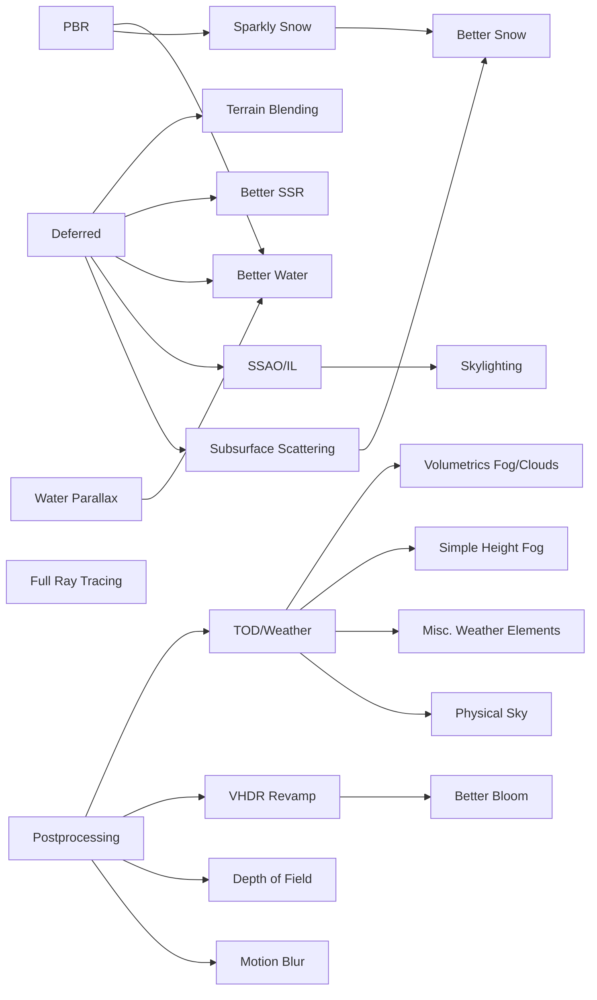

Welcome to the Skyrim Community Shaders Documentation!

# Current list of features and versions
Please ensure you match this to avoid compilation errors.

| Object         | Feature                    | [CS](https://www.nexusmods.com/skyrimspecialedition/mods/86492)         | [ENB](http://enbdev.com/download.html)  | [CS VR](https://www.nexusmods.com/skyrimspecialedition/mods/86492)   | [ENB VR](http://enbdev.com/download.html)  |
|----------------|----------------------------|------------|------|------|------|
| Grass          | Grass Collisions           | Yes        | Yes  | Yes  | No   |
|                | Grass Lighting             | Yes        | Yes  | Yes  | No   |
| Water          | Water Parallax             | Yes        | Yes  | Yes  | No   |
|                | Water Blending             | Yes        | Yes  | Yes  |      |
|                | Water caustic              | Yes        | No   | Yes  | No   |
|                | Screen Space Reflections   | Yes        | Yes  | Yes  | No   |
| Lights         | Particle Lights            | Yes        | Yes  | Yes  | Yes  |
|                | Light Limit Fix            | Yes        | No   | Yes  | No   |
|                | Indirect Lighting / SSGI   | Beta       | Yes  | Beta |      |
|                | Tree LoD Lighting          | Yes        | No   | Yes  | No   |
| Shadows        | Normalmap Shadows          | No         | Yes  | No   | Yes  |
|                | Screen-Space Shadows       | Yes        | Yes  | Yes  | Yes  |
|                | Distant Shadows            | Yes        | Yes  |      | Yes  |
|                | Ambient Occlusion          | Beta       | Yes  | Beta | Yes  |
| Rain           | Wet Surfaces               | Yes        | Yes  | Yes  | Yes  |
|                | Puddles                    | Yes        | No   | Yes  | No   |
|                | Dynamic rain drops         | WIP        | No   | Yes  | No   |
| Sky            | Sun Rays                   | Beta       | Yes  | Yes  | Yes  |
|                | Sun Glare                  | No         | Yes  |      | Yes  |
|                | Volumetric Rays            | Beta       | Yes  | Yes  | Yes  |
|                | Procedural Sun             | WIP        | Yes  |      | Yes  |
|                | Cloud Shadows              | Beta       | Yes  | Beta | Yes  |
|                | Skylighting                | No         | Yes  | Beta |      |
| Terrain        | Terrain Parallax           | Yes        | Yes  | Yes  | No   |
|                | Terrain Blending           | Beta       | Yes  | Yes  | No   |
| Actors         | Skin Specular              | WIP        | Yes  |      | Yes  |
|                | Subsurface Scattering      | Yes        | Yes  | Yes  | Yes  |
| Objects        | Object Parallax            | Yes        | Yes  | Yes  | Yes  |
|                | Physically Based Rendering | Beta       | No   | Yes  | No   |
|                | Dynamic Cubemaps           | Yes        | Yes  | Yes  | Yes  |
| Screen effects | Depth of Field             | No         | Yes  | n.a. | n.a. |
|                | Bloom                      | Yes        | Yes  | Yes  | Yes  |
|                | HDR                        | Yes        | Yes  | Yes  | Yes  |
|                | Adaptation                 | Yes        | Yes  | Yes  | Yes  |
| Performance    | Upscaling Technologies     | Beta       | No*  | WIP  | No*  |
|                | FSR AA / DLAA              | Yes        | No*  | Yes  | No*  |
|                | Framegen (DLSS)            | Beta       | No   | No   | No   |
|                | Variable rate shading /FFR | WIP        | No   | WIP  | No   |

\* can be achieved via 3rd party mod

A graph of potential future features, no gaurantee:

# Testing

## A/B Testing
For those who want to compare visuals with different settings, there is a mode to automatically switch between two modes on an interval.
1. Set up A environment by selecting "Save Settings". This is your default settings under `CommunityShadersUSER.json` and will display as `User Mode`.
2. Change settings for the B environment for whatever features you want. This will display as `Test Mode`.
3. Under the `Advanced` menu, find the slider for `Test Interval`.

4. Set the interval to any non-zero value. This is the number of seconds to stay in any mode before switching. This will create a new config file, `CommunityShadersTEST.json`. In the desktop window, you should see a countdown in the top left. You can also monitor the settings changed in 2 to confirm they are changing back and forth.

5. To exit the A/B test, set `Test Interval` to 0. You will still have your settings from step 2.
6. To restore your default settings, select "Load Settings".

## Dynamic Cubemaps
There is a special test mode that can be activated to turn basically any cubemap surface into a maximum reflective surface. Examples are potions or wine bottles. 
1. Under Advanced -> Shader Defines, enter `TESTCUBEMAP`.
2. Clear Disk Cache, if disk cache enabled.
3. Clear Shader Cache.
4. Examine an object and the environment should be reflected in the item.